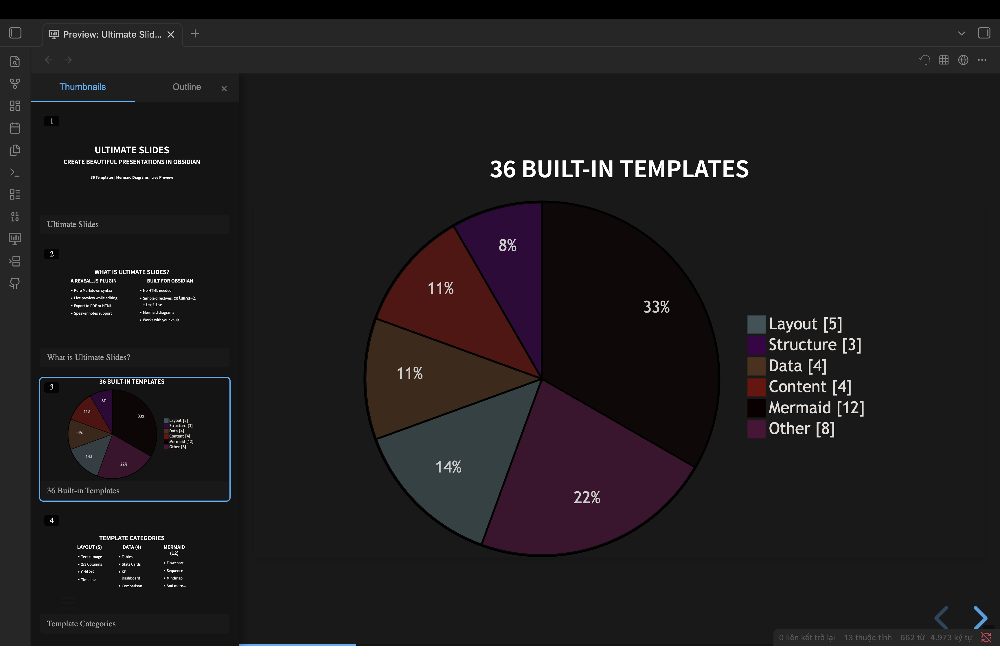
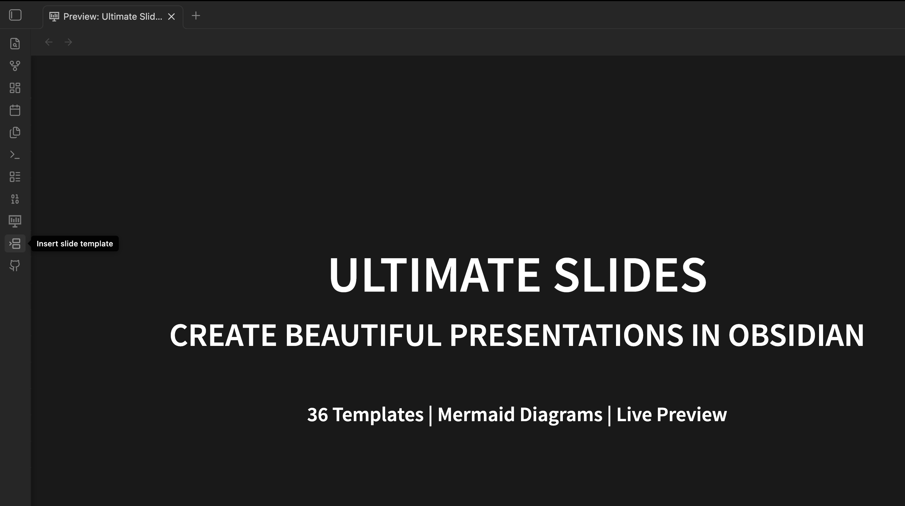
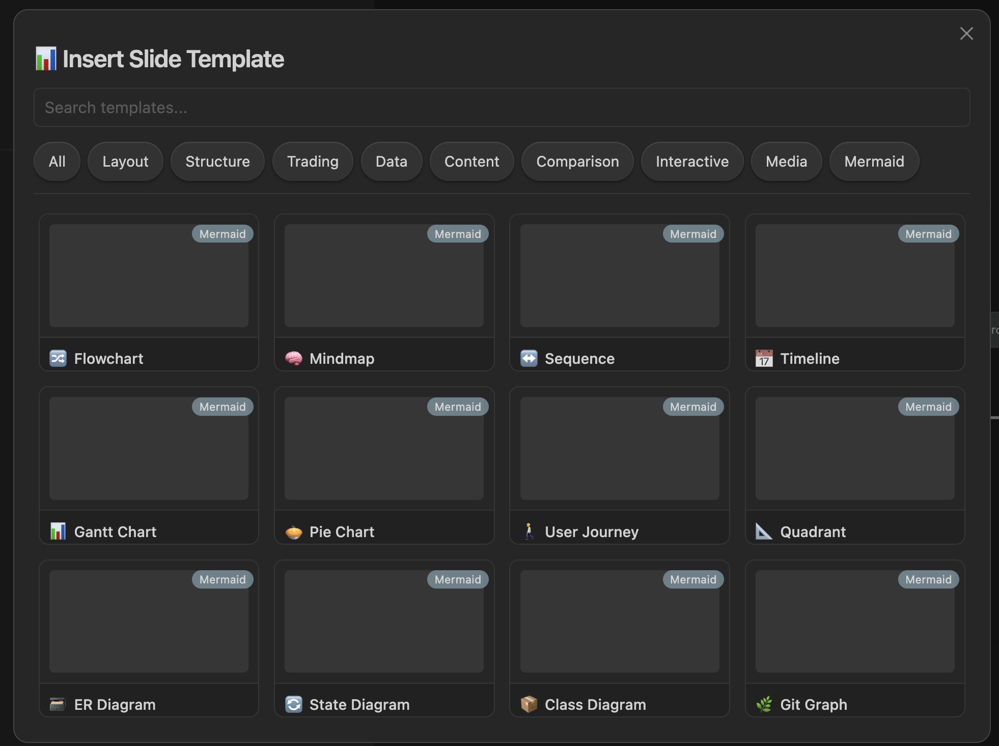
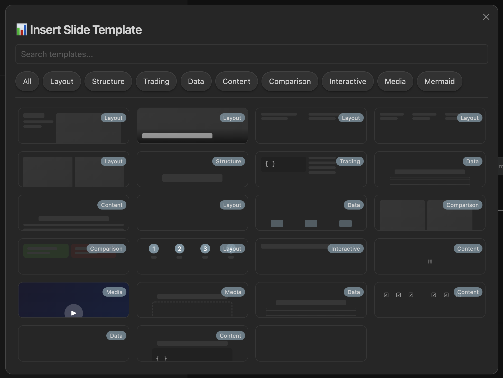

# Ultimate Slides for Obsidian

Create beautiful markdown-based presentations with [reveal.js](https://revealjs.com/) directly in Obsidian.

> Forked from [Slides Extended](https://github.com/ebullient/obsidian-slides-extended) by Erin Schnabel

## Features

- **Live Preview** - See changes instantly while editing
- **36+ Built-in Templates** - Quick-insert slide layouts, data visualizations, and Mermaid diagrams
- **Mermaid Diagrams** - Full support for flowcharts, sequence diagrams, mind maps, timelines, and more
- **Rich Layouts** - Grid system, split views, columns, and responsive designs
- **Themes** - Multiple reveal.js themes included
- **Export** - PDF and standalone HTML export
- **Full Obsidian Syntax** - Links, embeds, callouts, and more

## What's New in Ultimate Slides

- **Navigator Panel** - Sidebar with thumbnail previews and outline view (press `N`)
- **Template Inserter** - Command palette (`Cmd/Ctrl+P` → "Insert slide template") with visual preview
- **Markdown Layout Directives** - Use `columns-2`, `columns-3`, `timeline`, `grid-2x2` for easy layouts
- **Fixed Mermaid Rendering** - Diagrams now render at full size
- **Bundled Assets** - No external downloads required
- **Simplified Setup** - Works out of the box

### Navigator Panel

Resizable sidebar with thumbnail previews and outline navigation. Press `N` or click the ☰ button:



### Template Inserter

Click the template icon in the ribbon or use Command Palette to insert templates:



### 36 Built-in Templates

Browse and insert from layout, data, content, and Mermaid diagram templates:



### Mermaid Diagrams

12 Mermaid diagram templates with proper sizing and dark theme:



## Installation

### From Community Plugins

1. Open Obsidian Settings → Community Plugins
2. Search for "Ultimate Slides"
3. Install and enable

### Manual Installation (BRAT)

1. Download the latest release from [Releases](https://github.com/tohaitrieu/obsidian-ultimate-slides/releases)
2. Extract to `.obsidian/plugins/ultimate-slides/`
3. Restart Obsidian and enable the plugin

## Quick Start

1. Create a new markdown file
2. Add frontmatter:
   ```yaml
   ---
   theme: black
   transition: fade
   ---
   ```
3. Use `---` to separate slides
4. Click the presentation icon or use `Cmd/Ctrl+P` → "Open slide preview"

## Templates (36 Total)

Access via Command Palette → "Insert slide template":

### Layout (5)
- Text + Image (1/3 + 2/3)
- Image Overlay Bottom
- 2 Columns / 3 Columns
- Grid 2x2
- Timeline

### Structure (3)
- Section Header
- Call to Action
- Thank You

### Data (4)
- Table
- Stats Cards
- KPI Dashboard
- Comparison Table

### Content (4)
- Fragment List
- Quote
- Checklist
- Code Highlight

### Comparison (2)
- Before/After
- Pros/Cons

### Interactive (1)
- Quiz

### Media (2)
- Video Background
- Iframe Embed

### Trading (1)
- Key Levels

### Mermaid Diagrams (12)
- Flowchart
- Mindmap
- Sequence Diagram
- Timeline
- Gantt Chart
- Pie Chart
- User Journey
- Quadrant Chart
- ER Diagram
- State Diagram
- Class Diagram
- Git Graph

## Slide Syntax

### Basic Slide
```markdown
---

## Slide Title

Content here

---
```

### Grid Layout
```markdown
<grid drag="50 80" drop="5 10">
Content in a positioned box
</grid>
```

### Split View
```markdown
<split even>
Left content
+++
Right content
</split>
```

### Layout Directives (NEW)

Use simple markdown directives instead of HTML:

```markdown
columns-3
### Column 1
First column content

### Column 2
Second column content

### Column 3
Third column content
```

Supported directives:
- `columns-2`, `columns-3`, `columns-4` - Multi-column layouts
- `timeline` - Horizontal timeline view
- `grid-2x2` - 2×2 grid layout

### Fragments (Animations)
```markdown
<!-- element class="fragment" -->
This appears on click
```

### Speaker Notes
```markdown
note: These are speaker notes
```

## Themes

Available themes: `black`, `white`, `league`, `beige`, `sky`, `night`, `serif`, `simple`, `solarized`, `blood`, `moon`

```yaml
---
theme: black
highlightTheme: zenburn
---
```

## Configuration

| Option | Default | Description |
|--------|---------|-------------|
| `theme` | `black` | Slide theme |
| `transition` | `slide` | Transition effect |
| `width` | `960` | Slide width |
| `height` | `700` | Slide height |
| `controls` | `true` | Show navigation controls |
| `progress` | `true` | Show progress bar |

## Credits

- Original [Slides Extended](https://github.com/ebullient/obsidian-slides-extended) by Erin Schnabel
- Based on [Advanced Slides](https://github.com/MSzturc/obsidian-advanced-slides) by MSzturc
- Powered by [reveal.js](https://revealjs.com/)

## License

MIT License - see [LICENSE](LICENSE) for details
